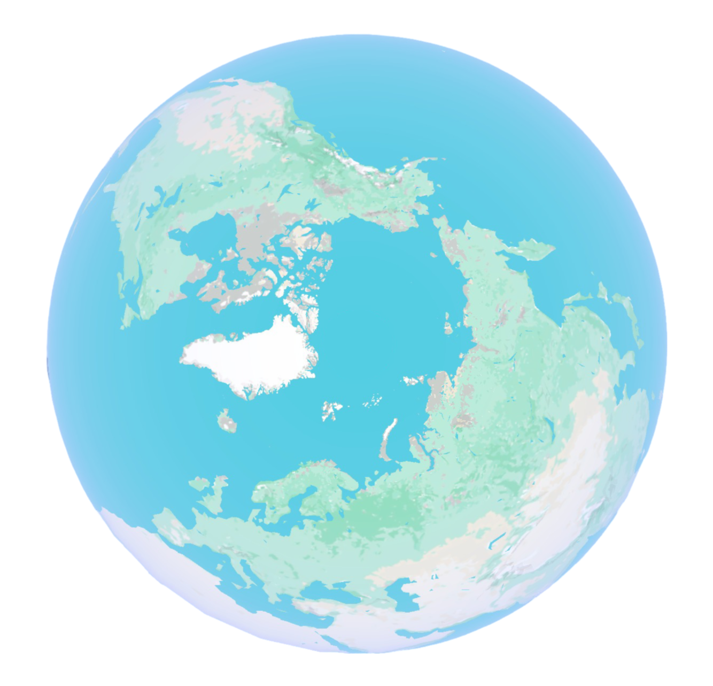

# Riemannian Manifolds

This section covers relevant knowledge of Riemannian 2-Manifolds by motivating and explaining key concepts through definitions and examples. It is mainly intended to give intuition and working knowledge for later sections, so it will stick to 2-manifolds, but the definitions and ideas will carry into higher (or lower)dimensions with the same principles. 

For millenia society thought that earth was a flat, because that's what it looks like up close. If we model earth as a unit-ball, then its surface, the unit-sphere, looks locally flat. Mathematically, we say that each point on the sphere is locally topologically equivalent (homeomorphic) to $\reals^2$.

## Definition: Manifold
An n-manifold is a topological space with the property that each point has a neighborhood that is homeomorphic to an open subset of $\reals^n$.

---

Although the surface of the earth lies in our physical 3-dimensional space, we humans have found a way to parametrize it in terms of just two numbers, latitude and longitude, which yield a local representation. The Equirectangular projection maps the sphere to $[-\pi/2, \pi/2) \times [-\pi, \pi]$, which are spherical coordinates that correspond exactly to the geographical coordinates $\text{Lat}^\circ$ and $\text{Lon}^\circ$. One might erroneously have thought that this was what the Mercator projection does, but the latter will stretch the latitude near the two poles for good reasons.
[INSERT PICTURE OF EQUIRECTANGULAR MAP https://en.wikipedia.org/wiki/Equirectangular_projection]

---
## Definition: Coordinate Chart
A 2D coordinate chart of $\mathcal{M}$ is a pair $(C, f)$, where $f$ is a diffeomorphism $$f: U \to C$$ that maps open subset $U$ of a 2-manifold $\mathcal{M}$ to an open subset $C \subseteq \reals^2$, resulting in a real-vector space representation of $U$.

---
## FOOTNOTE: 🦶
A diffeomorphism is a bijection between two differentiable manifolds such that both it and its inverse are continuous. Strictly speaking, a homeomorphism is enough here (meaning not necessarily differentiable), but since we are ultimately interested in doing calculus on our manifold, we need a differentiable representation of it.

---

## Example: Coordinate Chart
We will use the surface of the earth as $\mathcal{M}$ and construct a our own coordinate chart. For simplicity, we will only be mapping the open upper hemisphere $\subset \mathcal{M}$ to the open unit-disc $C$ by projecting the hemisphere onto the unique plane that cuts through the equator. 

An invertible map from the unit-disc to the hemisphere is given by $$\text{disc-to-hemisphere}(\begin{bmatrix}x & y\end{bmatrix}^\top) = \begin{bmatrix}x & y & \sqrt{1 - x^2 - y^2}\end{bmatrix}^\top $$ The inverse of this map corresponds exactly to projecting the hemisphere onto the equatorial plane.
[PICTURE OF UNIT DISC AND DOME WITH ARROW MAPPING THEM].

[PICTURE OF GOOGLE EARTH SEEING PART OF NORTHERN HEMISPHERE]
[PICTURE OF PROJECTION WITH EQUIDISTANT LONGITUDAL LINES]
TODO: SPACE OUT THE LONGITUDAL LINES ONE FOR EACH 10 DEGREES.
When we use our map on the real chart, we end up with the above map. Note how the longitudal lines get compressed towards the edge. In our chart, local coordinate $(0, 0)$ corresponds to the north-pole. We will further study properties of this map in following examples.

---

## Metric Tensor

Good maps are characterized by being amenable to direct measurements. A weakness of the Equirectangular Projection is the distortion of landmasses at the poles. They are disproportionately big when compared to a countries such as Kenya at the equator. This difference in scale invalidates direct measurements of lengths using a conventional ruler. The Metric Tensor quantifies the distortions induced by the map, and is a vital tool for measurements on coordinate charts.

Before giving a definition, we will further motivate the Metric Tensor by pointing out what one takes for granted in Euclidean space (specifically, $\reals^2$). $\reals^2$ is a vector space, meaning that linear combinations of the basis-vectors $e_1$ and $e_2$ are still members of $\reals^2$. In a vector space we can additionally define a norm and an inner product. The Euclidean norm is defined as $||(x,y)||_2 = \sqrt{x^2 + y^2}$ and is used to define the distance $d(\vec{a}, \vec{b}) = ||\vec{a}-\vec{b}||_2$. The Euclidean inner product $\langle \vec{a},\vec{b} \rangle = a_1b_1 +a_2b_2$ relates to the angle $\theta$ (radians) between vectors through $\frac{\langle \vec{a},\vec{b} \rangle}{||\vec{a}||||\vec{b}||} = \cos(\theta)$.

---
## FOOTNOTE: 🦶
$\reals^2$ is technically the set of all ordered pairs of real numbers, but in the context of differential geometry, it is also the Euclidean plane.

---

On the contrary, the surface of the earth is not a vector space. There can be no set of basis vectors, because there is no defined notion of addition or scaling of coordinates (we do not add pairs ($\text{Lat}^\circ$., $\text{Lon}^\circ$.), and we do not scale them). Even though we have coordinates, we still don't get distances or angles, because we don't have the inner product or norm. This is the problem the metric tensor solves. 

Before diving into the metric tensor, we will have to define the notion of tangent spaces.

---

## Definition: Tangent space
The tangent space $\mathcal{TM}_p$ at a point $p$ on a 2-manifold $\mathcal{M}$ is the 2-dimensional real vector space consisting of all tangent vectors to $\mathcal{M}$ at $p$. Each tangent vector can be associated with the velocity of a curve on $\mathcal{M}$ passing through $p$. 

## Example: Tangent space
The tangent space is a local "linearization" of the manifold around a point $p$. On the sphere, the tangent space of the north pole is the unique tangent plane that intersects only the north pole. Moving from $p$ along a vector from the tangent space will in general take one away from the manifold.

## Definition: Metric Tensor

When using a 2-dimensional coordinate system, the 2D metric tensor is a symmetric, positive-definite 2×2 matrix $g(p) = M \in \reals^{2\times 2}$  where $p$ is a point on the two-dimensional surface specified in local coordinates. $M$ provides a way to measure lengths, angles by describing how the infinitesimal length $ds$ of a change in local coordinates $t=\begin{bmatrix} dx & dy\end{bmatrix}^\top \in \mathcal{TM}_p$ is computed as:

$$ds^2 = M_{11}dx^2 + 2M_{12}dxdy + 2M_{22}dy^2 = \begin{bmatrix} dx & dy\end{bmatrix} \begin{bmatrix} M_{11} & M_{12} \\ M_{12} & M_{22}\end{bmatrix} \begin{bmatrix} dx \\ dy\end{bmatrix} = t^\top M\; t $$

and angle $\theta$ between tangent vectors $t, t^\prime \in \mathcal{TM}_p$ are computed as $$\cos(\theta) = \frac{t^\top M \; t}{\sqrt{t^\top M \; t}\sqrt{t^{\prime \top} M \; t^\prime}}$$

---

The explicit dependance of the metric tensor $g(p)$ on the coordinate $p$ is often omitted in notation, but we will keep it explicit. 

## Definition: Riemannian Metric

A 2D Riemannian metric $g$ maps each local coordinate $p\in C$ to a metric tensor 
$$g: C\to \reals^{2\times 2}$$

---

To compute gradients and curvature (see later section), the metric must be at least twice differentiable.

Informally, $ds$, $dx$, and $dy$ are the same symbol as $dx$ in $\int_0^1 f(x) \;dx$. They are 'differentials'. Intuitively, if we were to relate the integral back to the Riemann sum, $dx$ is the size of the interval in our partition of $[0, 1] \subset \reals$. In the current case, by having $ds$ depend on the position in local coordinates (through the dependence of the metric on $p$), we can assign "bigger partitions" to some areas, which lets us weigh different areas differently. We will use dependence to counteract the non-uniform stretching induced by mappings like Equirectangular projection or our projection of the hemisphere.

Positive-definiteness in the definition ensures that all squared infinitesimal distances $ds^2$ will remain positive, no matter the entries in $g$. $g$ can be thought of as encoding a local version of the pythagorean theorem. If $g = \begin{bmatrix} 1 & 0 \\ 0 & 1\end{bmatrix}$, then the formula for infinitesimal distance reduces to $$ds^2 = dx^2 + dy^2$$ which looks very similar to $c^2 = a^2 + b^2$. 

---

## FOOTNOTE: 🦶
$g(p) = \begin{bmatrix} 1 & 0 \\ 0 & 1\end{bmatrix}$ is the metric tensor of $\reals^2$, which is independent of position $p$. This reflects the (perhaps unsurprising) fact that the Pythagorean theorem holds at all positions in $\reals^2$, not just around the origin or some other specific point.

---
## Example: Rank of Metric Tensor

The rank of the 2D metric tensor $g(p)$ will always be 2 by positive-definiteness. However, rank-deficit metric tensors can be interesting to study for intuition. 

Consider the metric tensor $m= \begin{bmatrix} 1 & 0 \\ 0 & 0\end{bmatrix}$, for which the infinitesimal length-formula reduces to $ds = dx$. With this metric, locally the length of infinitesimal $\begin{bmatrix} dx & dy \end{bmatrix}^\top$ depends only on $dx$ with no contribution from $dy$. We would say that at this point the space is locally one dimensional, with space being collapsed in direction of the second basis. 

In the same scenario the $\cos(\theta)$ formula will yield only $0$ and $\pi$, which are the only two possible angles between parallel vectors. 

For a rank 0 matrix (which is the 2x2 zero matrix), $ds = 0$, and angles are not defined as a division by zero occurs.

## Example: Determinant of Metric Tensor

The determinant of the 2D Metric Tensor reflects how areas are scaled locally. By positive-definiteness, the determinant will be strictly positive.

## Example: Measuring the length of a path with the Metric Tensor

If a sailor plans a route (not necessarily straight) on their chart, they will be keen to know the length it represents. From the distortion of the maps seen earlier, we have determined that we cannot simply measure directly, as lengths are not guaranteed to have been represented faithfully. To measure exactly the length of a route, we will have to integrate an expression the infinitesimal length $ds$ of the velocity vector of the line over the whole span of the line. 

We will parameterize the route $r$ with parameter $t \in (0, T)$ to get $r: (0, T) \to \reals^2$. $r$ is in fact a 1-manifold, and the parameterization a choice of local coordinate system. 

Symbolically, the length can be written simply as $L(r) = \int_r ds$ where $ds$ is the infinitesimal length obtained from the metric tensor $g(p)$. But this is not very computable definition. By using the local parameterization we get:

$$\begin{align*} 
L(r) = \int_{[0, T]} \sqrt{\nabla r(t)^\top g(r(t))\; \nabla r(t)} \; dt
\end{align*}$$

Even for many seemingly simple cases of $g$ and $r$ this integral has no analytic solution, because it turns out to be an instance of an elliptic integral, which are integrals of the form $\int \sqrt{P(t)}$, where $P$ is some polynomial of $t$. There will be an instance of this later, where we will resort to numerical methods.

## Example: Computing the Metric on the chart induced by the 3D hemisphere
Starting from our previous map from the disc,
$$\text{disc-to-hemisphere}(\begin{bmatrix}x & y\end{bmatrix}^\top) = \begin{bmatrix}x & y & \sqrt{1 - x^2 - y^2}\end{bmatrix}^\top $$ 
The Riemannian metric on the chart induced by the 3D hemisphere can be computed as 
$$g(p) = J(p)^\top J(p) \in \reals^{2\times 2}$$ 
where $J(p) \in \reals^{3\times 2}$ is the Jacobian matrix of $\text{disc-to-hemisphere}$ at point $p$, which maps tangent vectors $ \in \reals^2$ to tangents vectors $\in \mathcal{TM} \subset \reals^3$.
The Jacobian comes out as
$$ J\left(\begin{bmatrix}x \\ y \end{bmatrix}\right) = \begin{bmatrix}1 & 0 \\ 0 & 1 \\ \frac{-x}{\sqrt{1-x^2-y^2}} & \frac{-y}{\sqrt{1-x^2-y^2}}\end{bmatrix}$$
which gives the final metric of
$$g_{\text{hemisphere}}\left(\begin{bmatrix}x \\ y \end{bmatrix}\right)=\frac{1}{1-x^2-y^2} \begin{bmatrix} 1 & xy \\ xy & 1 \end{bmatrix}$$
This is symmetric, positive definite and well-defined in for $x^2+y^2 < 1$, which is exactly the open unit-disc. At the center, $(0,0)$, the metric tensor coincides with the Euclidean metric, reflecting the fact that the north-pole did not get distorted during the projection, as it was already aligned with the plane we project onto.

## Example: Visualizing the Metric Tensor
In cartography, a common way to visualize the degree distortion of the chart is using the Tissot Indicatrix. [FIGURE OF Equirectangular TISSOT]. It shows how patches of equal area and shape on the earth will be represented on the map. The Equirectangular Projection necessarily stretches the two poles into two huge areas. An approximation of the Tissot Indicatrix can be computed using the metric tensor, by showing the eigenvectors and -values of the inverse metric tensor. [FIGURE OF Hemisphere TISSOT. We can see that, when getting close to the border, there is heavy compression along the outwards radial latitudal direction, while the longitudal distances are unaltered.]
[FIGURE of projected streched sheet metric]
[FIGURE of projected bell metric]
[FIGURE of hyperbolic metric]

## Definition: Riemannian Manifold
A Riemannian Manifold is a pair $\big(\mathcal{M}, g\big)$ of a smooth manifold $\mathcal{M}$ with Riemannian metric $g$.

## Definition: Isometric Immersions and Embeddings, Ambient Space
An isometric immersion of a Riemannian 2-Manifold $\big(\mathcal{M}, g\big)$ into a 2-dimensional submanifold $\hat{\mathcal{M}} \in \reals^3$ is a map $f: \mathcal{M} \to \hat{\mathcal{M}}$ such that the distance between any two points in $\mathcal{M}$ under $g$ is the same as the distance between their images under $f$ measured along the surface of in $\reals^3$. If $f$ is additionally a bijection, meaning that $\hat{\mathcal{M}}$ does not self-intersect, $f$ is an embedding. If it self-intersects it is an immersion. The space that the manifold is mapped into is referred to as the ambient space. Throughout this thesis, where applicable, the ambient space is $\reals^3$.

## Example: Isometric embedding
For the Riemannian Manifold $\big(\text{open unit disc}, g_{\text{hemisphere}}\big)$, by construction of $g_{\text{hemisphere}}$ from the hemisphere, $\text{disc-to-hemisphere}(\cdot)$ is an isometric embedding. 
We will later cover an example of a 2-manifold that cannot be isometrically embedded in $\reals^3$.

## Definition: Intrinsic and Extrinsic Properties

Properties of Manifolds can be grouped into two categories. Extrinsic properties require the manifold to be viewed as part of the ambient space. An example is the normal vector, which by definition is orthogonal to the tangent space at each point. 

Intrinsic properties are independent of any embedding and arise solely from the manifold's internal structure. These include path lengths and angles.

## Representing Manifolds on a Computer

We consider two representations of Riemannian 2-Manifolds: Manifolds given by a local coordinate system and a metric (intrinsic representation), or Manifolds represented as triangle meshes (extrinsic representation).

### Extrinsic Representation
When given a triangle mesh and no metric tensor, one can only assume that 

### Intrinsic Representation

## Triangulations of Manifolds
A computer works with discrete objects. The 

## Simplicial Complex

